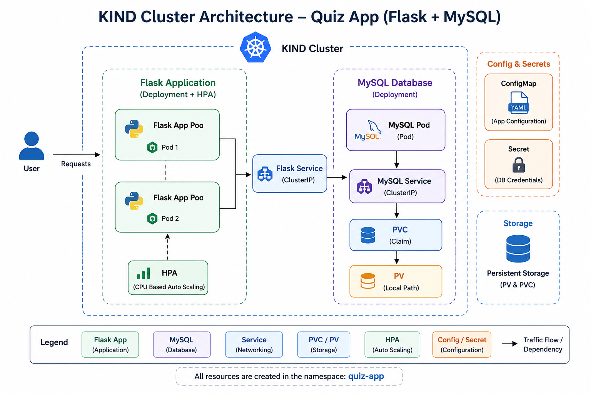

# Kubernetes Quiz App Deployment on KIND

A simple **Flask + MySQL Quiz Application** deployed on a local **Kubernetes (KIND)** cluster. This project demonstrates how to deploy a multi-container application using Kubernetes resources such as **Namespace, Persistent Volume (PV), Persistent Volume Claim (PVC), ConfigMap, Secret, Deployments, Services, and Horizontal Pod Autoscaler (HPA).**

---

# Project Architecture

<p align="center">
  
</p>

---

# Features

- Flask Quiz Application
- MySQL Database
- Kubernetes Deployment
- Persistent Storage using PV & PVC
- ConfigMap for application configuration
- Secret for database credentials
- ClusterIP Services
- Horizontal Pod Autoscaler (HPA)
- Local Kubernetes Cluster using KIND

---

# Project Structure

```text
quiz-app/
│
├── kubernetes/
│   ├── namespace.yaml
│   ├── mysql-pv.yaml
│   ├── mysql-pvc.yaml
│   ├── quiz-configmap.yaml
│   ├── quiz-secret.yaml
│   ├── mysql-deployment.yaml
│   ├── mysql-service.yaml
│   ├── flask-deployment.yaml
│   ├── flask-service.yaml
│   ├── flask-hpa.yaml
│   ├── kind-config.yml
│   └── install.sh
│
└── 
```

---

# Prerequisites

- Docker
- KIND
- kubectl
- Docker Image pushed to Docker Hub

---

# Step 1 - Create Namespace

Create a dedicated namespace for the project.

```bash
kubectl apply -f kubernetes/namespace.yaml
```

---

# Step 2 - Create Persistent Volume (PV)

Create a Persistent Volume to provide storage for MySQL.

```bash
kubectl apply -f kubernetes/mysql-pv.yaml
```

---

# Step 3 - Create Persistent Volume Claim (PVC)

Create a Persistent Volume Claim to request storage from the PV.

```bash
kubectl apply -f kubernetes/mysql-pvc.yaml
```

---

# Step 4 - Create ConfigMap

Create ConfigMap to store application configuration.

```bash
kubectl apply -f kubernetes/quiz-configmap.yaml
```

---

# Step 5 - Create Secret

Create Secret to securely store MySQL credentials.

```bash
kubectl apply -f kubernetes/quiz-secret.yaml
```

---

# Step 6 - Deploy MySQL Database

Deploy the MySQL database with the configured storage and environment variables.

```bash
kubectl apply -f kubernetes/mysql-deployment.yaml
```

---

# Step 7 - Create MySQL Service

Expose the MySQL deployment internally within the Kubernetes cluster.

```bash
kubectl apply -f kubernetes/mysql-service.yaml
```

---

# Step 8 - Deploy Flask Application

Deploy the Flask Quiz Application and connect it with the MySQL database.

```bash
kubectl apply -f kubernetes/flask-deployment.yaml
```

---

# Application Running (Before HPA)

<p align="center">
  
</p>

---

# Step 9 - Enable Horizontal Pod Autoscaler (HPA)

Configure Horizontal Pod Autoscaler to automatically scale Flask pods based on CPU utilization.

```bash
kubectl apply -f kubernetes/flask-hpa.yaml
```

---

# Step 10 - Create Flask Service

Expose the Flask application inside the cluster.

```bash
kubectl apply -f kubernetes/flask-service.yaml
```

---

# Application Running (After HPA)


---

# Verify Resources

```bash
kubectl get all -n quiz-app
```

Check Persistent Volume

```bash
kubectl get pv
```

Check Persistent Volume Claim

```bash
kubectl get pvc -n quiz-app
```

Check HPA

```bash
kubectl get hpa -n quiz-app
```

---

# Technologies Used

- Python Flask
- MySQL
- Docker
- Kubernetes
- KIND
- Persistent Volume (PV)
- Persistent Volume Claim (PVC)
- ConfigMap
- Secret
- Deployment
- Service
- Horizontal Pod Autoscaler (HPA)

---

# Author

**Muhammad Shahid**

DevOps & Cloud Enthusiast

GitHub: https://github.com/your-github-username