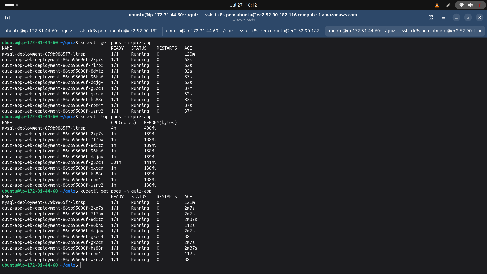
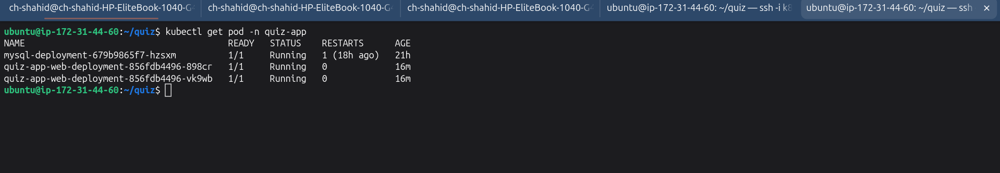

# Kubernetes Quiz App Deployment on KIND

A simple **Flask + MySQL Quiz Application** deployed on a local **Kubernetes (KIND)** cluster. This project demonstrates how to deploy a multi-container application using Kubernetes resources such as **Namespace, Persistent Volume (PV), Persistent Volume Claim (PVC), ConfigMap, Secret, Deployments, Services, and Horizontal Pod Autoscaler (HPA).**

---

# Project Architecture

<p align="center">
  
</p>

---

# Features

- Flask Quiz Application
- MySQL Database
- Kubernetes Deployment using KIND
- Persistent Storage with PV & PVC
- ConfigMap for Application Configuration
- Secret for Database Credentials
- ClusterIP Services
- Horizontal Pod Autoscaler (HPA)
- Metrics Server Integration
- Dockerized Application

---

# Project Structure

```text
quiz-app/
│
├── kubernetes/
│   ├── namespace.yaml
│   ├── mysql-pv.yaml
│   ├── mysql-pvc.yaml
│   ├── quiz-configmap.yaml
│   ├── quiz-secret.yaml
│   ├── mysql-deployment.yaml
│   ├── mysql-service.yaml
│   ├── flask-deployment.yaml
│   ├── flask-service.yaml
│   ├── flask-hpa.yaml
│   ├── kind-config.yml
│   └── install.sh
│
├── screenshot/
│   ├── arch.png
│   ├── hpabefor.png
│   └── afterhpa.png
│
├── Dockerfile
├── app.py
├── requirements.txt
└── README.md
```

---

# Prerequisites

Install the following tools before starting.

- Docker
- kubectl
- KIND
- Git
- Docker Hub Account

---

# Step 1 - Create KIND Cluster

```bash
kind create cluster --config kubernetes/kind-config.yml
```

Verify cluster.

```bash
kubectl cluster-info
```

---

# Step 2 - Create Namespace

Create a dedicated namespace for the application.

```bash
kubectl apply -f kubernetes/namespace.yaml
```

---

# Step 3 - Create Persistent Volume (PV)

Create Persistent Volume for MySQL storage.

```bash
kubectl apply -f kubernetes/mysql-pv.yaml
```

Verify PV.

```bash
kubectl get pv
```

---

# Step 4 - Create Persistent Volume Claim (PVC)

Create Persistent Volume Claim.

```bash
kubectl apply -f kubernetes/mysql-pvc.yaml
```

Verify PVC.

```bash
kubectl get pvc -n quiz-app
```

---

# Step 5 - Create ConfigMap

Create ConfigMap for Flask application configuration.

```bash
kubectl apply -f kubernetes/quiz-configmap.yaml
```

Verify ConfigMap.

```bash
kubectl get configmap -n quiz-app
```

---

# Step 6 - Create Secret

Create Secret for MySQL credentials.

```bash
kubectl apply -f kubernetes/quiz-secret.yaml
```

Verify Secret.

```bash
kubectl get secret -n quiz-app
```

---

# Step 7 - Deploy MySQL Database

Deploy MySQL database.

```bash
kubectl apply -f kubernetes/mysql-deployment.yaml
```

Check Deployment.

```bash
kubectl get deployment -n quiz-app
```

Check Pods.

```bash
kubectl get pods -n quiz-app
```

---

# Step 8 - Create MySQL Service

Expose MySQL inside the Kubernetes cluster.

```bash
kubectl apply -f kubernetes/mysql-service.yaml
```

Verify Service.

```bash
kubectl get svc -n quiz-app
```

---

# Step 9 - Deploy Flask Application

Deploy Flask Quiz Application.

```bash
kubectl apply -f kubernetes/flask-deployment.yaml
```

Verify Deployment.

```bash
kubectl get deployment -n quiz-app
```

Verify Pods.

```bash
kubectl get pods -n quiz-app
```

---

# Application Running (Before HPA)

<p align="center">
  
</p>

---

# Step 10 - Install Metrics Server (Required for HPA)

Horizontal Pod Autoscaler requires Metrics Server.

### Install Metrics Server

```bash
kubectl apply -f https://github.com/kubernetes-sigs/metrics-server/releases/latest/download/components.yaml
```

---

### Edit Metrics Server Deployment

```bash
kubectl -n kube-system edit deployment metrics-server
```

Inside the Deployment under **containers.args**, add:

```yaml
- --kubelet-insecure-tls
- --kubelet-preferred-address-types=InternalIP,Hostname,ExternalIP
```

Save and Exit.

---

### Restart Metrics Server

```bash
kubectl rollout restart deployment metrics-server -n kube-system
```

---

### Verify Metrics Server

Check Pod.

```bash
kubectl get pods -n kube-system
```

Check Node Metrics.

```bash
kubectl top nodes
```

Check Pod Metrics.

```bash
kubectl top pods -n quiz-app
```

---

# Step 11 - Enable Horizontal Pod Autoscaler (HPA)

Deploy Horizontal Pod Autoscaler.

```bash
kubectl apply -f kubernetes/flask-hpa.yaml
```

Verify HPA.

```bash
kubectl get hpa -n quiz-app
```

Watch HPA.

```bash
kubectl get hpa -n quiz-app -w
```

---

# Step 12 - Create Flask Service

Expose the Flask application.

```bash
kubectl apply -f kubernetes/flask-service.yaml
```

Verify Service.

```bash
kubectl get svc -n quiz-app
```

---

# Application Running (After HPA)

<p align="center">
  
</p>

---

# Verify All Kubernetes Resources

```bash
kubectl get all -n quiz-app
```

Persistent Volumes

```bash
kubectl get pv
```

Persistent Volume Claims

```bash
kubectl get pvc -n quiz-app
```

ConfigMaps

```bash
kubectl get configmap -n quiz-app
```

Secrets

```bash
kubectl get secret -n quiz-app
```

Deployments

```bash
kubectl get deployment -n quiz-app
```

Pods

```bash
kubectl get pods -n quiz-app
```

Services

```bash
kubectl get svc -n quiz-app
```

Horizontal Pod Autoscaler

```bash
kubectl get hpa -n quiz-app
```

---

# Technologies Used

- Python Flask
- MySQL
- Docker
- Kubernetes
- KIND
- kubectl
- Persistent Volume (PV)
- Persistent Volume Claim (PVC)
- ConfigMap
- Secret
- Deployment
- Service
- Horizontal Pod Autoscaler (HPA)
- Metrics Server

---

# Author

## Muhammad Shahid

**DevOps & Cloud Enthusiast**

GitHub: https://github.com/your-github-username

LinkedIn: https://www.linkedin.com/in/your-linkedin-profile